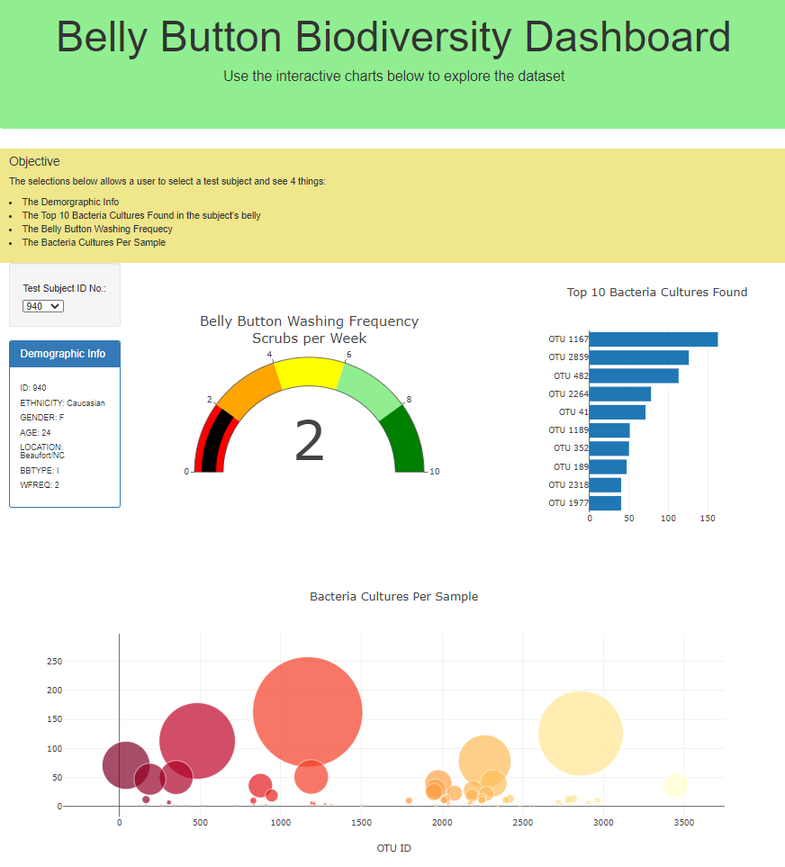

# Belly Button Biodiversity Dashboard

## Assignment Objective
Roza has a partially completed dashboard that she needs to finish. She has a completed panel for demographic information and now needs to visualize the bacterial data for each volunteer. Specifically, her volunteers should be able to identify the top 10 bacterial species in their belly buttons. That way, if ***Improbable Beef*** identifies a species as a candidate to manufacture synthetic beef, Roza's volunteers will be able to identify whether that species is found in their navel.

## 3 Changes made
1) Changed the background color of the jumbotron
2) Added more information about the project as a paragraph on the page
3) Changed the layout of the page (brought the guage chart to the left of the bar chart)

## Result

A very interactive website

**Live website**: https://govind-patwal.github.io/Belly_Button_Biodiversity_Dashboard/

**Screenshot**

